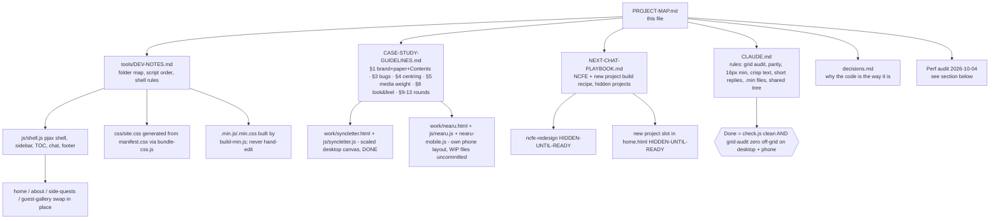

# Project map (graphify) — read this first, then only the doc you need

## Facts that never change
- Figma file `Nc087O4ophE87f3EyMdcVh`; frames NearU `351:1516`, Syncletter `419:964`, NCFE `438:3070` (copy of Syncletter layout, not content).
- Palette only in `css/base.css`: paper `#fff1df`, maroon `#7b2b3d`, text `#4a2e22`, headings `#39265f`, highlight `--hl-red #8f2000`. Font Ancizar Sans only (never Inter), bold = italic by design.
- Grid: desktop 41px rows phase 14, phone 28px phase 20; content centred in the beige area.
- Quality is non-negotiable (no lossy re-encode, no smaller dimensions); *delivery* (lazy, deferred, cached) may change.
- Run `node tools/check.js` after every change; commit only what you touched (`git status` first; NearU files are another chat's WIP).

## Perf audit 2026-10-04 (NearU case study was the lag)
| Finding | Evidence | Fix |
|---|---|---|
| Blanket `preload='auto'` on all `<video>` and all lazy images forced eager (js/nearu.js) | 16 MB video + 6.5 MB images before the first scroll; 14 videos fully buffered | Removed; IntersectionObserver loads each item ~1800px ahead. Initial video 16 MB → 1.7 MB |
| Hidden phone layout (`nearu-mobile`) holds 7 duplicate videos + 30 images, were loaded on desktop | `offsetParent == null` yet `readyState 4` | Same change (hidden items never intersect); idle warm-up skips hidden images |
| Grid alignment ran 4-6x at load and on every resize event, reading and writing layout per text block (forced reflow) | 342 ms + 123 ms long tasks | One coalesced scheduler (`queueAlign`), 120 ms resize debounce, desktop pass batched read-then-write. Long tasks → none |
| Not found | Empty body / excessive re-render: none. Static pages, ~1100 DOM nodes on the heaviest page, no framework, no render loops; JS heap 9 MB | — |

## Still open (not done, decide before doing)
- `nearu.js`, `nearu-mobile.js`, `nearu-demo.js`, `nearu.css` (76 KB) are not minified (WIP uncommitted); run `node tools/build-min.js --nearu` once committed.
- Source videos are large for their size: `demo-buyer.mp4` 3.8 MB, `demo-seller.mp4` 3.4 MB, `wireframes-final.mp4` 2.9 MB, `demo.mp4` 2.7 MB, `ideation-*.webp` ~1.9 MB each. Only re-encode if quality is judged identical (CLAUDE.md forbids lossy re-compression).
- `p5.min.js` (1 MB) is loaded on every grid page for the footer koi; could be loaded on first footer hover/visibility instead.
- Ancizar Serif is a render-blocking Google Fonts stylesheet; self-host it (decisions.md "Fonts").
- Stray 40 MB+ `node_modules`, `_source/` (p5.js 5 MB, SVGs) and `.claude/bank.*.js` backups are not served by the site but check they are not deployed (`.github/` workflow is untracked).
